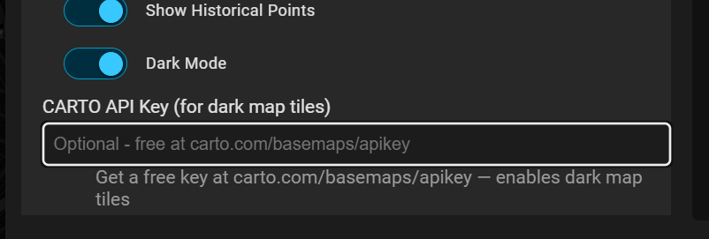

# Dark Mode Map Tiles

## Why not just use Home Assistant's dark mode?

Home Assistant's built-in dark mode applies CSS filters (like `invert()` and `hue-rotate()`) to all page elements, including map tiles. This approach produces washed-out, faded colors that don't look like a proper dark map — it simply inverts the light OSM tiles rather than rendering purpose-built dark cartography.

This card supports a proper dark map theme using **CARTO Dark Matter** tiles — a professionally designed dark basemap with dark backgrounds, muted roads, and readable labels.

## Setting up dark map tiles

Dark tiles require a free CARTO API key. No credit card needed.

### 1. Get a CARTO API Key

1. Go to [carto.com/basemaps/apikey](https://carto.com/basemaps/apikey/)
2. Enter your email address
3. Check your inbox for the API key (arrives in seconds)
4. Copy the key — it looks like a long JWT string

### 2. Add the key to the card

1. Edit your Lovelace dashboard
2. Click the edit button on the Google FindMy Device Card
3. Scroll to **CARTO API Key (for dark map tiles)**
4. Paste your key
5. Save



Make sure **Dark Mode** is also enabled in the card settings.

### 3. Done

The card will automatically use CARTO Dark Matter tiles when dark mode is enabled and a key is present. If no key is provided, the card falls back to standard OpenStreetMap light tiles.

## Free tier limits

| Feature | Limit |
|---------|-------|
| Monthly tile requests | **5,000,000** |
| Credit card required | No |
| CARTO account required | No |
| Commercial use | Contact CARTO for Enterprise license |
| Update frequency | Continuous (based on OpenStreetMap data) |
| CDN coverage | Global, 30+ points of presence |

For a typical Home Assistant dashboard with one map card, you'll use a few hundred requests per day — well within the free tier.

## Configuration options

```yaml
type: custom:googlefindmy-card
dark_mode: true          # Enable dark mode (default: true)
carto_key: "your-key"    # CARTO API key for dark tiles (optional)
```

## Troubleshooting

- **Tiles not loading?** Verify your key at [carto.com/basemaps/apikey](https://carto.com/basemaps/apikey/) — make sure it's the full key string with no extra spaces.
- **Still seeing light tiles?** Ensure `dark_mode: true` is set in your card config.
- **Rate limited?** You've exceeded 5M requests/month. Contact CARTO for a higher limit.
